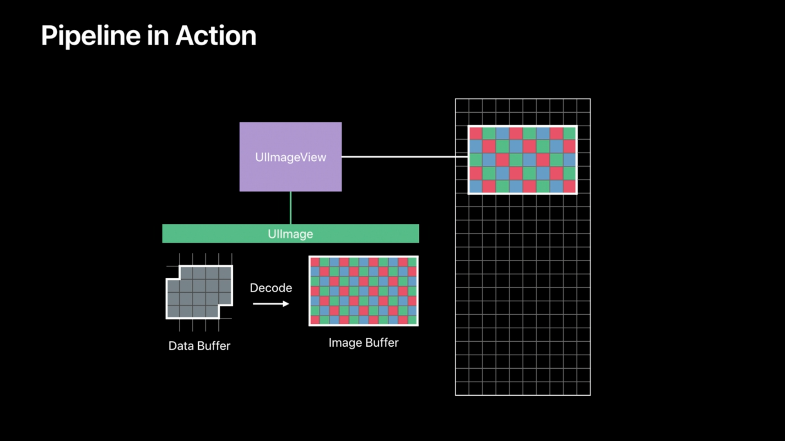

## WWDC 2018: Image and Graphics Best Practices

### UIImage/UIImageView

类比 MVC 架构，UIImage 就像 Model，负责加载数据（Load），UIImageView 就像 View，负责渲染显示数据（Render）。而实际情况下，在这两者之间还有一步解码（Decode）的过程。说到这个就要先提一下 Buffer 这个概念。

##### Buffer

Buffer 表示内存里的一段连续空间，但通常被看成是一个连续的元素序列。一个很重要的 Buffer 叫做 **Image Buffer**：

* 内存中表示图片中的一段空间
* 每个元素描述一个单独的像素颜色
* Buffer 的大小和图片大小成正比

一个很重要的 Buffer 叫做 **frame buffer**，它用来存储应用实际的渲染输出，当应用的视图层级发生变化的时候，UIKit 将应用的 Window 以及它的子视图渲染到 frame buffer 里，这个 frame buffer 存储了每个像素的颜色信息，显示设备将读取 frame buffer 里的信息并显示到屏幕上。

作为对比，我们看一下 **Data Buffer**：

* 内存中保存图片文件的一段空间
* 含有描述图片尺寸的元数据
* 编码后的文件（例如 JPEG，PNG），通常是压缩后的
* 内存字节并不直接描述像素信息

图片从加载到显示的流程：



其中，解码（Decoding）涉及以下几个方面：

* CPU 密集型操作
* 系统会持有这个图片以便于重复使用
* 持久占据一个较大的内存分配
* 与原始图片尺寸成正比，而与视图大小无关

上面这几点很容易造成内存使用方面的一些问题：

* 增加内存碎片，内存索引的位置可能会比较分散
* 为了获取足够的内存，系统可能需要压缩（其他应用的）内存，这会加重 CPU 的负载
* 进程被终止

节省内存使用的一个方法叫降采样（Downsampling）：


这个方法是使用 ImageIO 里的 CGImage 相关操作，按照想要的大小（一般为视图大小）来解码图片并渲染到视图上：


上面的代码有几个需要注意的地方：

```swift
let imageSourceOptions = [kCGImageSourceShouldCache: false] as CFDictionary
```

这个选项告诉 CoreGraphics 我们只是想要创建一个包含图片源文件信息的对象而不是立刻解码这个图片。

```swift
...
kCGImageSourceShouldCacheImmediately: true,
...
```

这个设置选项告诉 CoreGraphics，当我们命令它创建缩略图（thumbnail）的时候，立刻为我们创建一个解码后的 frame buffer。

##### 在滑动视图里解码图片

有两个方法可以提高滑动视图里解码图片时的体验：

* 预加载（prefetching）：UICollectionView/UITableView 的 prefetch 相关方法
* 后台线程解码/降采样

例如：


但是上面的做法可能会造成线程爆炸的问题：

* 由于 CPU 数量是有限的，需要解码的图片数量很容易就超过可使用的 CPU 核心数量
* GCD 不断创建线程来执行队列里的任务，造成线程数量急剧增加
* 由于线程过多，CPU 在多个线程间切换的开销很大，每个线程所获得的 CPU 时间太少，无法在有限时间内完成图片解码的任务

为了避免上面这些问题，我们应该创建一个串行队列来负责解码和降采样：


##### 图片资源来源

* Image Assets in asset catalog
* application/framework bundle 里的文件
* app 沙盒里 Documents 和 Cache 目录
* 从网络下载的图片数据

这几种方式中，强烈推荐使用第一种方式，有几个原因：

* Image assets optimized for name based and trait based lookup
* 缓存从 Image assets 里创建的图片时更智能
* 针对设备的图片瘦身
* 支持向量图片

##### 向量图片的使用流程

与位图类似，只不过中间的解码步骤变成了光栅化操作：


向量图做了下面这些优化：

* Xcode 编译时根据 scale 的值来对图片进行光栅化操作
* 使用图片时，如果需要的尺寸是向量图的自然尺寸那么就会直接使用预光栅化好的图片直接进行解码显示，这省去了运行时光栅化的操作
* 如果你预先确定图片只会使用固定的几个尺寸，那么可以分别对这几个尺寸创建位图，这样可以利用上面这条创建预先光栅化好的图片

### Custom drawing with UIKit

 
 
 对于 UIImageView 来说，它请求 CPU 对图片解码并将解码后的图片赋给与它关联的 CALayer，而 UIView 则是由与它关联的 CALayer 创建一个 Backing store（image buffer），然后 UIView 执行 draw 函数并将执行的结果填充到 image buffer 里。
 
这个 backing store，也就是 image buffer，在内存开销方面有以下需要注意的地方：

* 与 view 的尺寸是成比例的
* iOS 12 有一个新特性：backing store 里元素的大小与你要绘制的颜色内容相关。举例来说，如果你绘制的是扩展的 SRGB 颜色范围，那么它所需要的大小就比单纯绘制 0-1 范围的要大很多。
* 如果你想禁用上面这个优化，可以设置 CALayer.contentsFormat 来显示的指定你想要绘制的颜色范围

#### 减少 backing store 的使用

由于使用 backing store 会增加内存开销，因此我们应该减少使用backing store：

* 将大视图重构为小视图组成的视图层级
* 减少重写 `draw(_:)` 方法
* 删除对图片数据的重复拷贝操作
* 使用经过优化的视图属性和子类
* 设置 backgroundColor 不会创建 backing store，但使用 pattern color 会。应该使用 UIImageView 平铺这些图片来代替
* UIView.maskView 和 CALayer.maskLayer 会将视图层级渲染到一个临时的 image buffer里，如果你想要设置视图的圆角，应该使用 CALayer.cornerRadius 而不是设置 mask，因为它不会创建额外的 image buffer。

#### 离屏渲染

离屏绘制图片可以使用 UIGraphicsImageRenderer，之前还有一个类似的函数：UIGraphicsBeginImageContext，但它不支持 wide color range。在 iOS 12 里，与 CALayer 类似，UIGraphicsImageRenderer 也添加了动态调整 image buffer 大小的功能。

### Advanced CPU and GPU techniques

* 实时特效尽量使用 Core Image，因为它将运行在 GPU，从而解放 CPU
* UIImageView 渲染 CIImage 效率很高
* 与 Metal，Vision，Accelerate 等框架交互时，使用 CVPixelBuffer 传递数据

