# WWDC 2018: Introducing Network.framework: A modern alternative to Sockets

### Modernizing transport APIs

使用 Sockets 来进行网络连接已经不太适应现代网络编程的需求，Socket 在这几个方面使用起来很麻烦：

* 建立连接（Connection Establishment）
    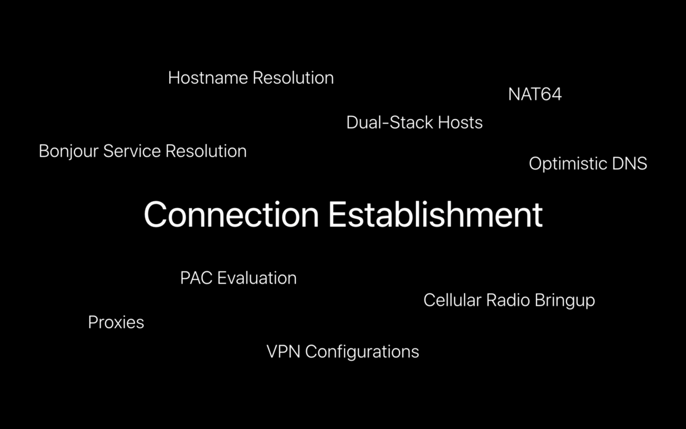
* 数据传输（Data Transfer）
    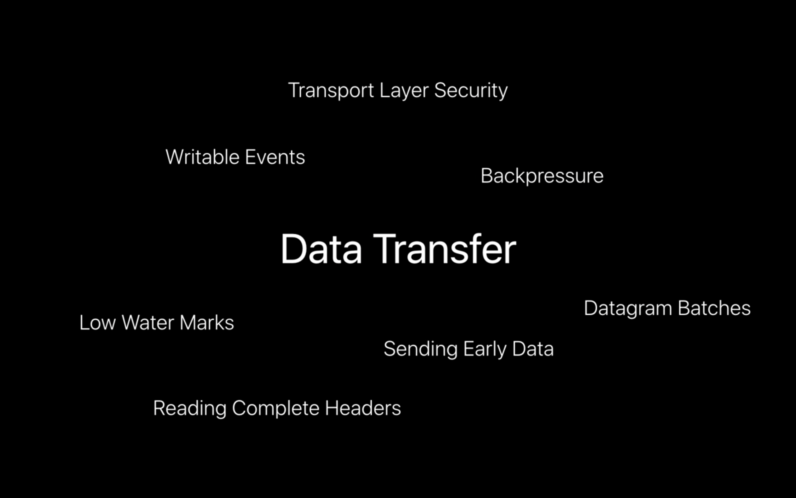
* 移动性（Mobility，手机等移动设备相关）
    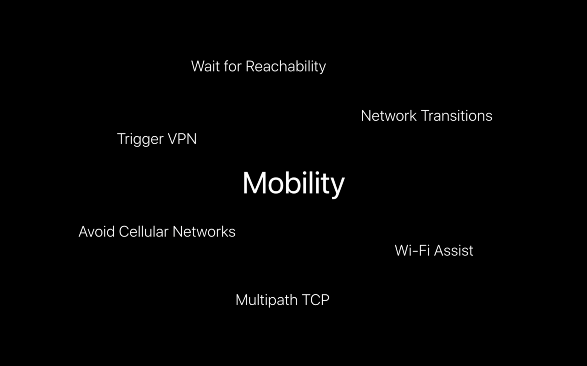

幸运的是，在苹果生态系统内已经有了很易用的 API：URLSession

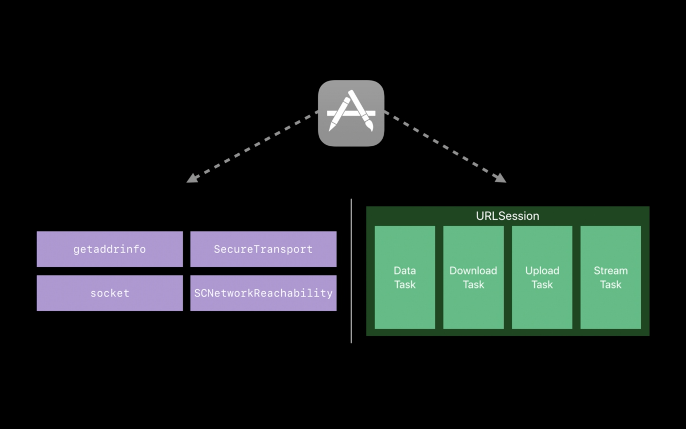

它帮我们处理很多底层连接校验的事情，我们只需要专注于 HTTP 连接就可以了，当然它也提供了 Stream 接口，让我们可以直接处理 TCP/TLS 连接。但是，URLSession 并不直接构建于这些底层框架之上，它现在是建立在 Network.framework 上的：

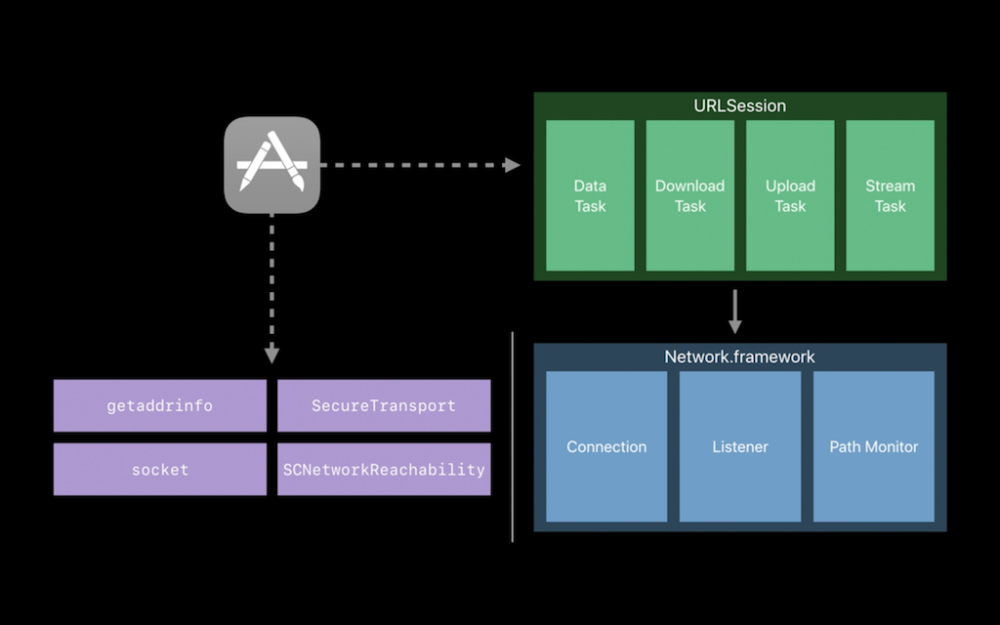

Network.framework 有下面几个优点：

* 智能建立连接（Smart Connection Establishment）
* 优化数据传输
* 内建的安全传输控制
* 移动设备上无缝的网络切换体验
* 原生支持 Swift

### Making your first connections

以邮件服务为例，建立连接需要以下设置：

* 主机名（hostname）：mail.example.com
* 端口（port）：993
* 协议（protocol）：TLS/TCP

使用传统的 Sockets 进行连接需要哪些步骤呢？

1. 使用 `getaddrinfo()` 进行 DNS 解析
2. 调用 `socket()` （ipv4 或者 ipv6）
3. 调用 `setsockopt()` 设置 socket 参数选项
4. 调用 `connect()` 创建 TCP 连接
5. 等待写数据事件

上面的过程使用 Network.framework 的话，步骤如下：

1. 使用 `NWEndPoint` 和 `NWParameters` 创建连接。`NWEndPoint` 表示地址或者域名以及端口信息，`NWParameters` 表示连接参数，例如使用的协议（TCP，UDP，TLS，DTLS）或者是否仅使用 WiFi 进行连接
2. 调用 `connection.start()`
3. 等待连接（connection）状态变成 `.ready`

那么上面步骤用代码演示是什么样呢？

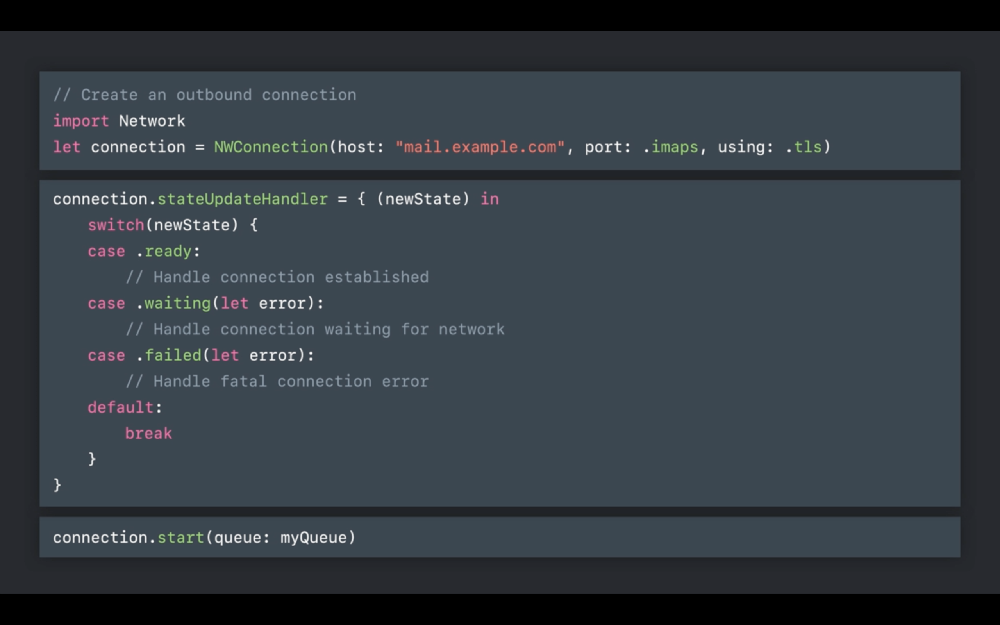

当我们调用 `connection.start()` 后，这个 connection 的状态就从 `.setup` 变成了 `.preparing`，相比 TCP Socket 的 `connect()`，它在背后为我们做了更多的处理操作（connect() 仅仅向服务器发送一个 CN packet 包），这一步称为 `Smart Connection Establishment`。

首先，它会查询当前可供使用的网络情况。假如说目前 WiFi 和蜂窝网络（Cellular）都可以工作，那么它会优先选择 WiFi（节省用户流量）。接着，它将检测是否有 VPN 或其他代理，如果配置了 PAC 代理，并且这个连接访问的地址就在代理规则中，则它将使用规则中的地址为我们创建连接，否则就发起直接连接，查询 DNS，并使用返回结果中的地址尝试创建连接。

如果 WiFi 访问出现问题（比如说我们在一栋建筑物里走来走去，WiFi 连接不稳定），那么连接就会无缝的回退到蜂窝网络

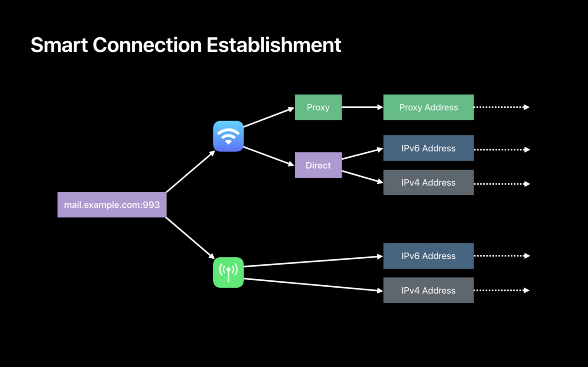

当然，你可以通过 NWParameters 来控制上面的过程，比如说你只想使用 WiFi 创建连接来节省用户流量：

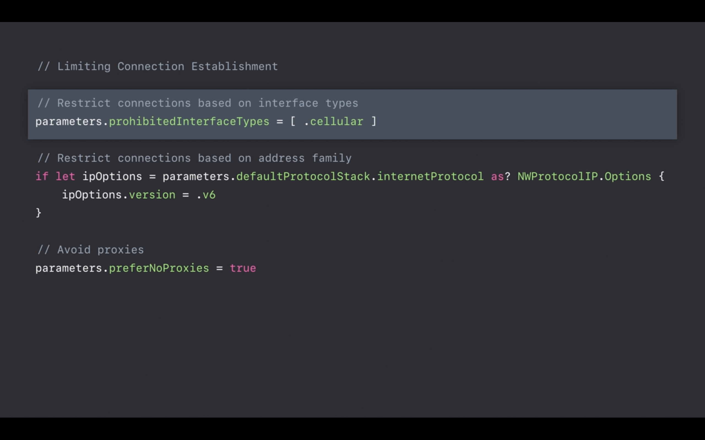

一个 connection 完整的生命周期是这样的：

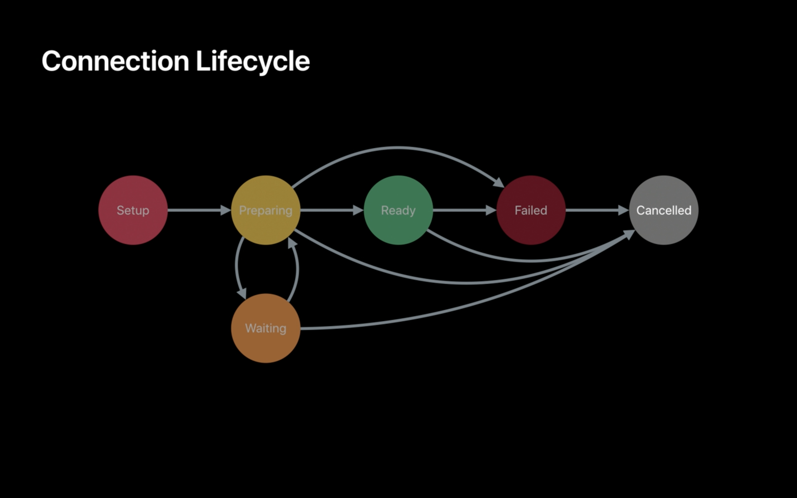

> 下面是一个 Live Streaming 的例子，由于是现场代码演示，因此直接观看 WWDC 视频比较好。

### Optimizing data transfer

对于 TCP/UDP 来说，发送和接收（send and receive）数据是最核心的操作，Network.framework 重点优化了收发数据的体验。

#### Send

先看一个例子：

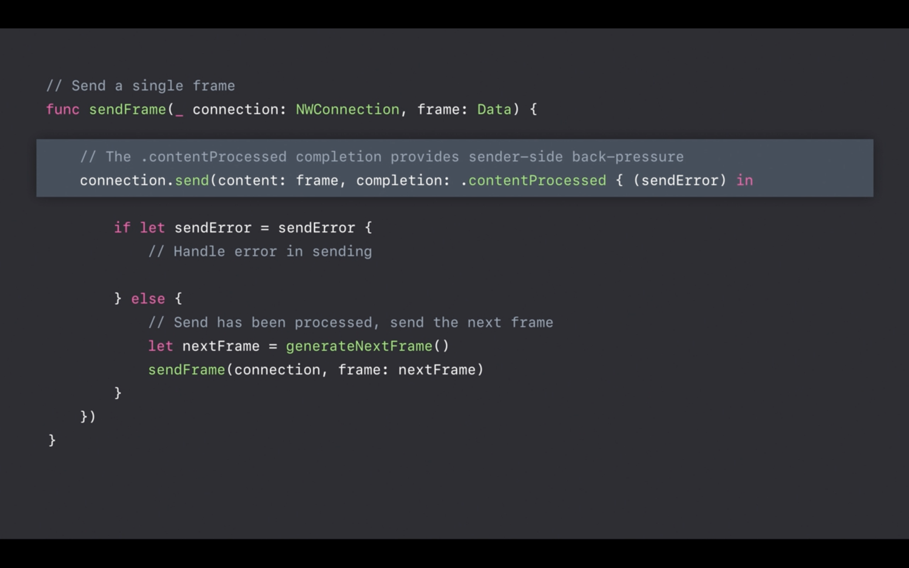

对于 Sockets 来说，你可以选择阻塞或者非阻塞 socket 来发送数据。如果使用阻塞 socket，那么数据很大的时候它将阻塞当前线程并等待网络传输完成；如果使用非阻塞 socket，那么它可能不会像你想的那样一次就把所有数据发送出去，可能它会先发送 50KB，接着再发送 50KB，这样的话，你需要手动维护发送状态，记录数据传输进度。

而使用 Network.framework 的 connection 的话，你不需要操心这些事情，你可以简单的将所有的数据都通过调用 send 发送出去，框架会自动帮你处理这些事情，并且不会阻塞当前线程。但现实情况并不是简单的发送出去就完事了的，为了提高应用的响应体验，你需要通过 completion 处理发送完（不一定成功发送，仅代表系统处理完）的操作。像上面代码里那样，检查是否出错，如果没有出错，发送下一帧数据。

关于发送的另一个优化是批量发送：

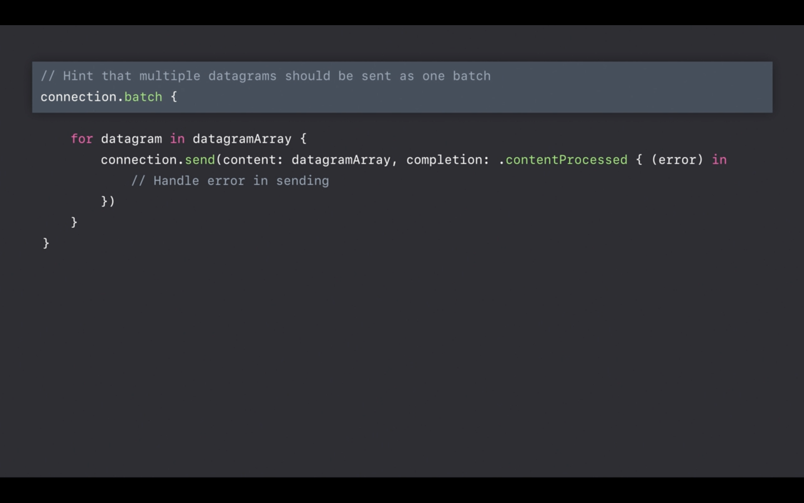

传统的 UDP 操作只能一个接一个发送数据报，这在实践中非常低效，因为这会造成大量的用户态和内核态的上下文切换。而 Network.framework 支持 batch 操作，你可以随意地在这个 block 里做发送或接收操作，但这些操作并不会立即发送到协议栈里，系统会延迟这些操作并在 block 执行完之后一次性批量将这些数据报提交到内核协议栈里。

#### Read

再看读操作：

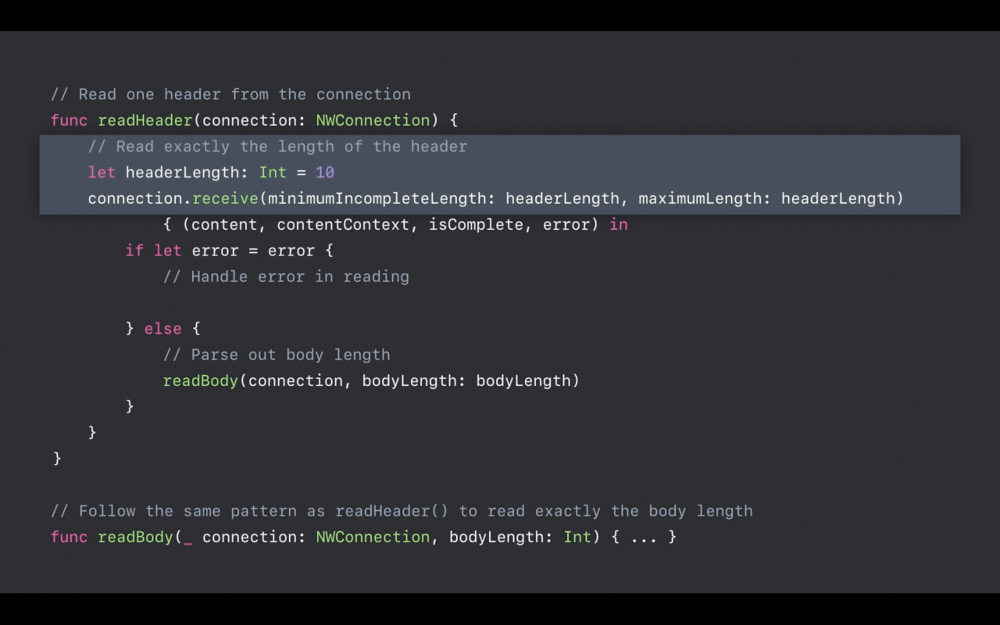

假设你采用的协议头长度为 10 个字节，协议头里包含 body 部分的长度信息。并且你想要先读取协议头的信息，然后再读 body 部分的数据。

使用传统的 Socket 尝试读取 10 个字节的数据，你可能一次性读取到 10 个字节的数据，也可能读到少于 10 个字节的数据，所以你需要不断的调用读操作直到读取到 10 个字节。接下来你要读取 body 部分的大量数据，在用户态和内核态不断切换，非常低效。

使用 Network.framework，调用读操作的时候你可以传入最小和最大读取长度，如果你想要读取 10 个字节的数据，你可以将这两个参数设为 10，系统会在恰好读取到 10 个字节数据时回调。它避免了应用在用户态和内核态的切换操作，非常高效。

#### ECN

除了收发之外，Network.framework 还提供了很多别的高级选项来帮助你提高用户体验。首先看一下 [ECN（explicit congestion notification，显式拥塞通知）](https://zh.wikipedia.org/wiki/显式拥塞通知)。

ECN 可以帮助我们在网络发生拥塞时平滑的调整收发速率，TCP 默认开启了 ECN，但以前对基于 UDP 的协议来说使用 ECN 会很困难。这里我们看 Network.framework 可以怎样帮助我们使用 ECN：

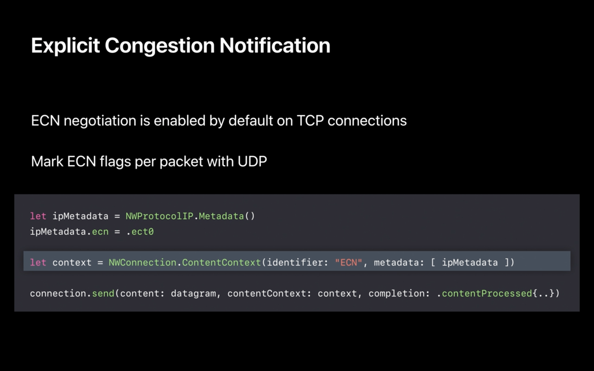

首先创建一个 ipMetadata 对象。ECN 由 IP 数据包里的标志位控制，这个 ipMetadata 允许你对单个 IP 数据包进行多种设置，并且你可以将这个操作包装到一个 context 对象里。调用 send 方法的时候，所有的包数据都会被设置上这个标记。对于 receive 操作你同样可以设置这个 context 对象来读取指定的标记位数据。

#### Service Class

我们还可以设置 service class。URLSession 同样支持设置这个属性，它表示网络流量的优先级。

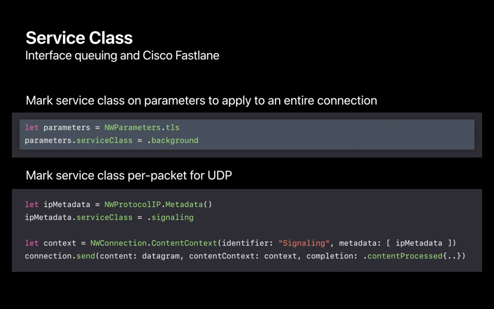

可以看到，这里通过设置 parameters.serviceClass 来设置整个连接的优先级为 .background，也就是一个较低的优先级。

但你同样可以为单个 UDP 数据包设置 service class。假设当前这个连接同时传输 voice 和 signaling，类似 ECN，通过创建 ipMetadata 并设置它的 serviceClass 属性为 .signaling。

#### Fast Open Connections

TCP fast open 允许你在发送第一个 SYN 包的时候附带上初始数据包数据，因此你不必等到握手完成后再开始发送应用数据。

使用 Network.framework 的话，你可以通过设置参数来开启 TCP fast open 功能：

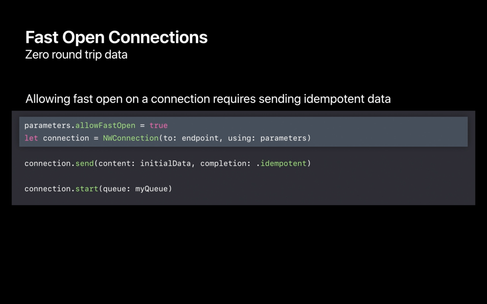

在调用 start 之前先调用 send 将 initialData 发送出去。注意到这里的 completion 使用的是 .idempotent 而不是 .contentProcessed，它表示这个数据可以被多次重复发送的（因为初始数据包可能被多次发送）。

这里还需要强调的一点是：这个 initialData 不是一定要发送你的应用数据。如果你在 TCP 之上使用 TLS，那么 TLS 的第一条消息可以当作这个 initialData。

如果你不想提供 initialData 而只想开启 TCP fast open 功能，那么你可以直接设置 TCP 选项：

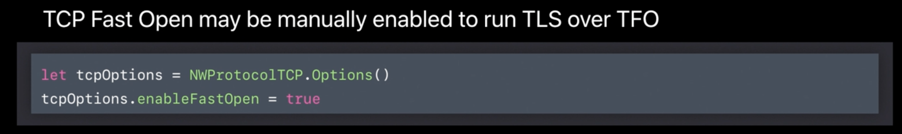

它会自动抓取 TLS 的第一条消息并在建立连接时发送出去。

#### Optimistic DNS

针对 DNS 还有一个称为`乐观 DNS`（Optimistic DNS） 的优化。DNS 是有时效限制的，当查询的结果过期后，我们可以乐观地认为这个结果依然是有效的并使用这个 IP 地址建立连接，同时，系统会并行的发起一个新的 DNS 请求。

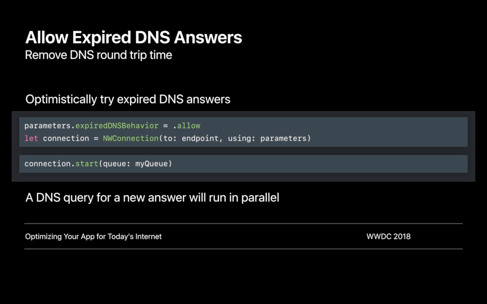

如果之前查询得到的 IP 地址确实是有效的，并且你设置了 `.expiredDNSBehavior = .allow`，那么这就省去了等待 DNS 查询结果的时间。如果服务器的地址确实改变了，那么系统将等待查询结果并用新得到的地址建立连接。

#### User-space Networking

这个优化不需要程序员做任何设置，只要使用 URLSession 或者 Network.framework 都将自动获得这个优化。先看一下传统的传输协议栈模型。

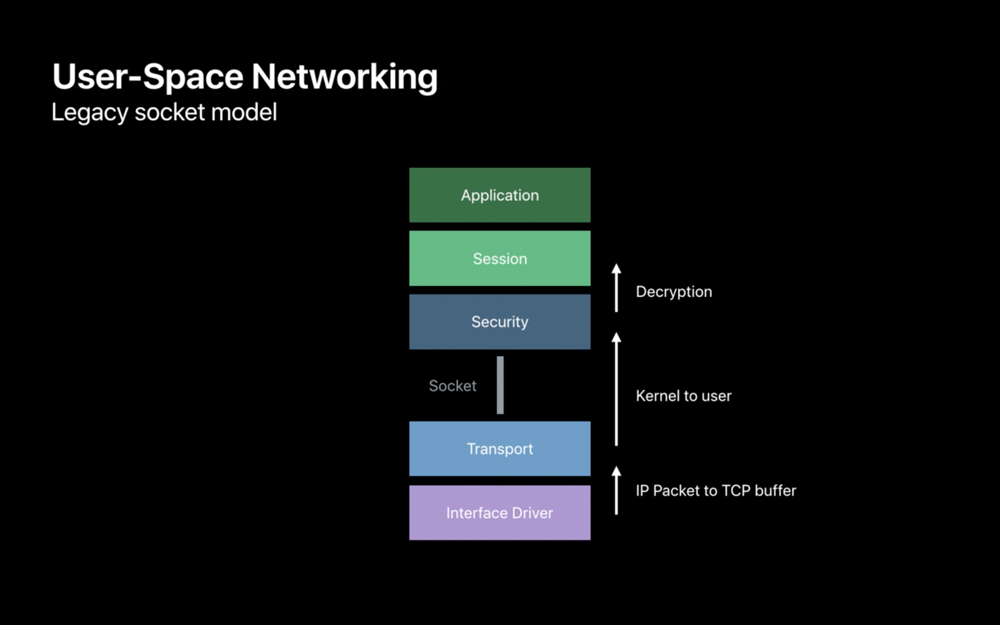

当数据包到来时，它将被发送到内核态的 TCP 接收缓冲区里，然后你的应用去读 socket，此时会发生一个上下文切换操作将数据从内核态复制到用户态，也就是你的应用里。

那用户态网络是什么样呢？

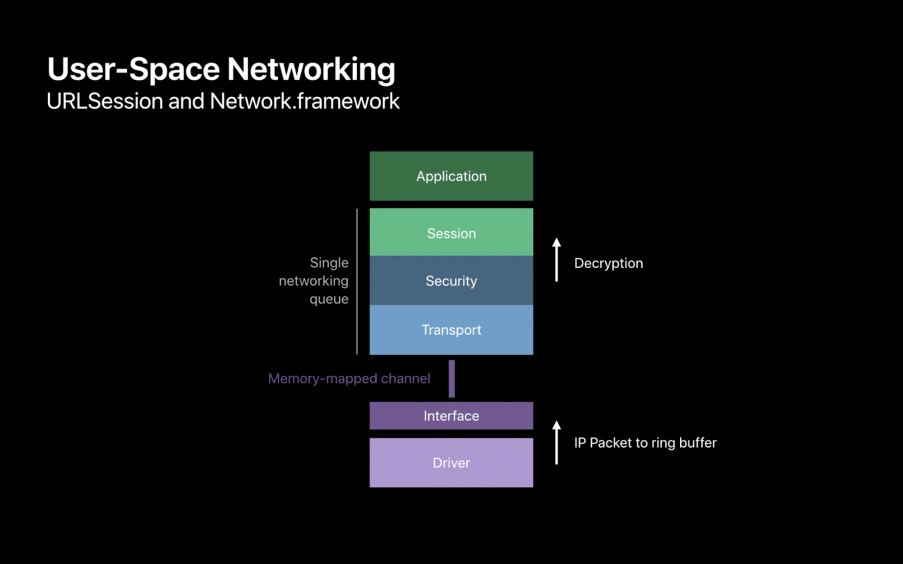

可以看到， TCP 和 UDP 已经移到了你的应用里。现在，当接收到一个数据包时，像之前一样，先进入到网卡驱动里，但我们将这个缓冲区移动到了一个支持内存映射的区域，你的应用可以读取这个地方的数据而不需要复制操作，避免了上下文切换。

使用这种方式，唯一涉及到传输的就是 TLS 的解密部分。

> 接着演示了一个 Live Streaming 应用，使用 Network.framework 大概比使用 Socket 编写的版本减少了 30% 的处理时间。

### Solving network mobility

首先，我们看一下如何让创建连接更加优雅。

* `.waiting` 状态是网络传输开始的关键部分，它表示此时还没有连接或者应用正在请求 DNS 或 TCP 的过程中。
* 建立连接之前避免使用类似 reachability 的方式去检查网络状态，因为它可能会导致竞态请求从而影响连接状态的准确性。
* 如果想要禁止 app 使用蜂窝网络，你不应该通过检查当前网络是否是蜂窝网络的方式，因为网络随时可能发生变化。你应该使用 NSParameters 来限制网络的使用。

所以一旦网络连接建立完成，此时应用处于 .ready 状态，接下来会有一系列事件告诉你网络发生了变化。第一个被称为`连接可访问性`（connection viability）。

假设你此时连接到了一个 WiFi 网络，接着你走到了电梯里，并且里面没有信号。此时，框架将以事件的形式告诉你此时网络无法连接，那么你应该怎么处理这种情况？

首先，如果有必要的话，可以告知用户此时没有可用的网络。其次，你也不必关掉网络连接，如果用户此时走出了电梯重新进入到刚才的 WiFi 网络环境中，连接将被重新激活。

```swift
isViable = false
betterPathAvailable = true
```

另一个通知事件是框架可以告诉你此时是否有更好的连接方式。接着上面的例子，当你走出这座大楼，此时已经无法连接到刚才的 WiFi 网络上，但用户的手机还有蜂窝网络可以用。因此我们会通知你两件事情：当前网络连接不可用，但此时还有一个更好的网络连接。设备会尝试将当前连接迁移到新的连接上。当一切就绪，你也可以重新恢复刚才的工作。

还有一种情况是用户当前正在使用蜂窝网络，然后他走进了一栋大楼并连上了里面的 WiFi。这种情况的话，如果你能够迁移当前连接，那么这将是一个良好的时机用来创建新连接并迁移数据到新连接上。

这两个都可以通过设置 connection 的 viability 相关 handler 来处理。

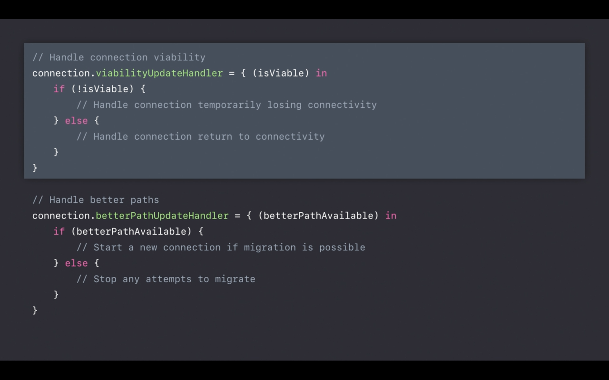

事实上，Multipath TCP 是更好的解决方式。如果你的服务器支持 Multipath TCP，那么你可以设置客户端来支持这种方式：`NWParameters.multipathServiceType`。那么连接可以自动在不同 的网络环境下自动迁移。当然，URLSession 也支持这个设置。

即使你通过 NSParameters 设置应用只使用 WiFi 网络，MPTCP 也可以帮助应用在不同的 WiFi 网络下自动迁移。

#### Watching Interface Changes

Network.framework 提供了一个叫做 NWPathMonitor 的 API，它允许你遍历当前所有可用网络，并且在这些网络发生变化时给你通知。如果你想在网络发生变化时通知用户的话，这种方式将会非常实用。

### Getting involved

* macOS 平台的 Network Kernel Extension 与 User Space Networking 不兼容
* FTP 和 File URL 将不再支持 Proxy Automatic Configuration（PAC），现在系统只支持 HTTP 和 HTTPS
* **CoreFoundation 部分 API 将被废弃，例如 CFStreamCreatePairWith 开头的相关 API；还有任何跟 sockets 或 CFSocket 有关的 API**
* **Foundation 部分 API 也不再推荐使用，例如 NSStream，NSNetService，NSSocket 等等**。
* 目前 Network.framework 还不支持 UDP 广播。

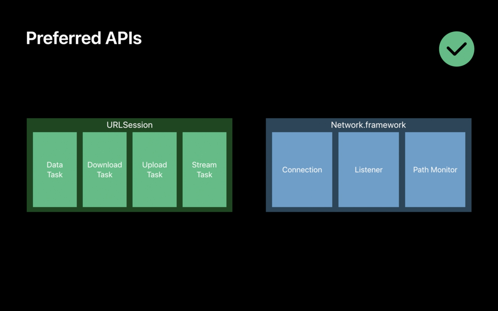