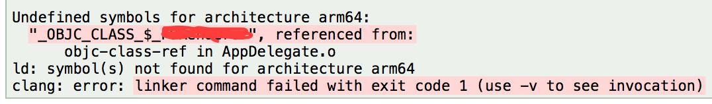
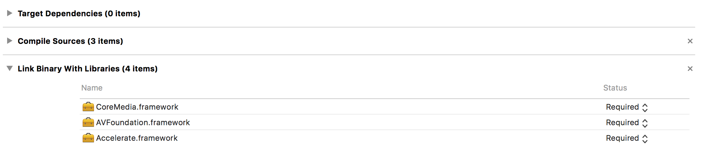

### block 未判空导致的 EXC_BAD_ACCESS 崩溃

我们在调用`block`时，如果这个`block`为`nil`，则程序会崩溃，报类似于`EXC_BAD_ACCESS(code=1, address=0xc)`异常（32位下的结果，如果是64位，则address=0x10）。这个异常表示程序在试图读取内存地址0xc的信息时出错。

在定义一个block时，编译器会在栈上创建一个结构体，类似于图2的结构体。

```objc
struct Block_layout {
	void *isa;
	int flags;
	int reserved;
	void (*invoke)(void *, ...);
	struct Block_descriptor *descriptor;
	/* Imported variables. */
}
```

`block`就是指向这个结构体的指针。其中的`invoke`就是指向具体实现的函数指针。当`block`被调用时，程序最终会跳转到这个函数指针指向的代码区。而当`block`为`nil`时，程序就会试图去读取`0xc`地址的信息，而这个地址什么都不会有(duff address)，于是抛出一个segmentation fault。在32位系统下，之所以是`0xc`，是因为invoke前面的三个成员变量的大小正好是12。

参考：[Why do nil / NULL blocks cause bus errors when run?](http://stackoverflow.com/questions/4145164/why-do-nil-null-blocks-cause-bus-errors-when-run)

### Undefined symbols for architecture xxx



一般来说就是没有链接用到的库，比如说第三方静态库，那就要将用到的第三方库拖到 `Link Binary With Libraries`:



或者是使用了 Cocoapods，这时需要设置 `Build Settings` -> `Linking` -> `Other Linker Flags`，增加 `$(inherited)`。

更具体的可以参考[这篇](http://www.jianshu.com/p/a243b62b2e72)。

### selector not recognized

如果静态库里有 Category 方法，有时候会报这个错误，[苹果官方文档](https://developer.apple.com/library/content/qa/qa1490/_index.html)有解释。也可以参考[这篇](https://my.oschina.net/u/728866/blog/194741)。

### embedded binaries VS link binary with libraries

Link: 共用 framework，通过 linker 告诉 app 动态载入 framework
embedded: 与 app 打包到同一个 bundle。然而实际上如果你是用 Swift，它目前依然是以独立的 Framework 链接到 app target

[这里](https://github.com/Carthage/Carthage/issues/1046)有个解释：

> Embedding binaries copies the entire framework to the target.
for building for ios/tvOS/watchOS apple has been strict in not allowing that the frameworks bundled are "fat" (that means that the libraries are built for multiple architectures: arm+i386+x86_64 for example) for keeping the binary sizes low.
that is why you should only link the frameworks but not embed them in ios, instead you add a run script phase that copies the framework stripping the data that does not belong to the target

[Apple 官方关于 Framework 的文档](https://developer.apple.com/library/content/technotes/tn2435/_index.html)

此外，如果是在同一个 app 内，即使是不同的 target（比如增加一个 Cocoa Touch Framework, 叫 TomCat.framework），也要用 embedded binaries 的方式，而如果是一个 workspace 里两个个不同的project（比如 Pods project）就需要用link的方式


